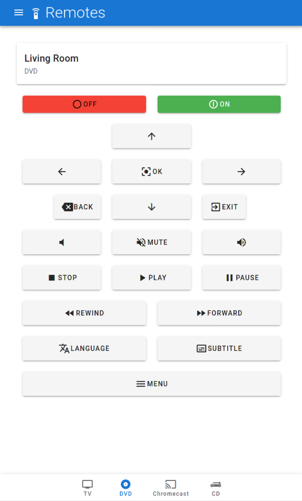
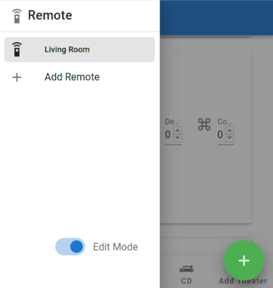
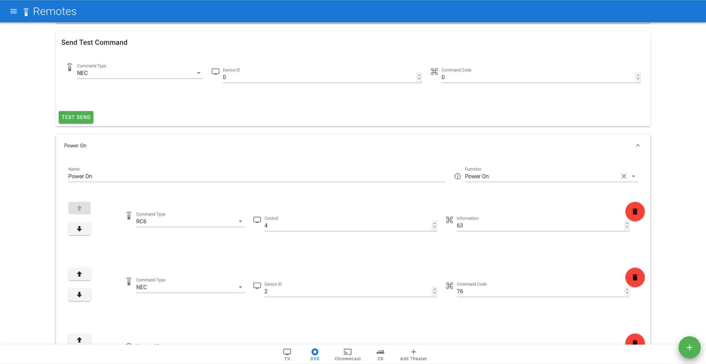

# IR Remote Frontend

This project is the UI for a controller which can be used to automate complex Set Top Box TV setups.

It currently supports communicating via IR with a [NEC](https://www.sbprojects.net/knowledge/ir/nec.php) and an [RC6](https://www.sbprojects.net/knowledge/ir/rc6.php) device as well as communicating via TCP / IP via the [Onkyo eiSCP](http://vtochq-it.blogspot.com/2018/12/onkyo-pioneer-network-remote-control.html) protocol.

The frontend is written in TypeScript with the [Vue.js](https://vuejs.org/v2/guide/) framework. It heavily utilizes [Vuetify](https://vuetifyjs.com/en/) for the UI.

## Installation

The whole project can be easily for test purposes executed via `docker-compose`. Just run `docker-compose up` in this project directory
and the UI bootstrap with the necessary backend and MQTT server is running locally and can be accessed in the browser via [`http://localhost:8080`](http://localhost:8080).

## Configuration

The UI includes a configuration panel for configuring the individual scenes and remotes. For this the `edit mode` needs to be enabled in the menu.

## Preliminary software

For this UI to actually do something it requires a running backend as well as a MicroController attached to it.

The source code for the backend, and the microcontroller as well as the pin layouts are located here:

- [ir-remote-backend](https://github.com/cbrand/ir-remote-backend) - Backend Code written in Golang supporting mutliple remotes.
- [esp32-ir-remote](https://github.com/cbrand/esp32-ir-remote) - MicroPython microcontroller code and layout for creating an own ir remote device.

## License

The software is released under the MIT license.
